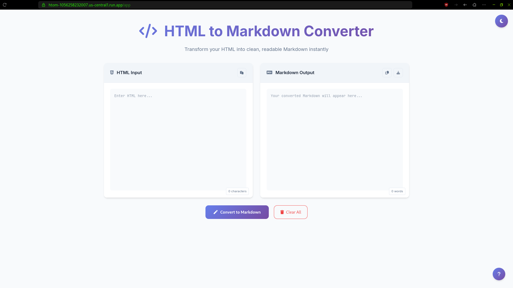
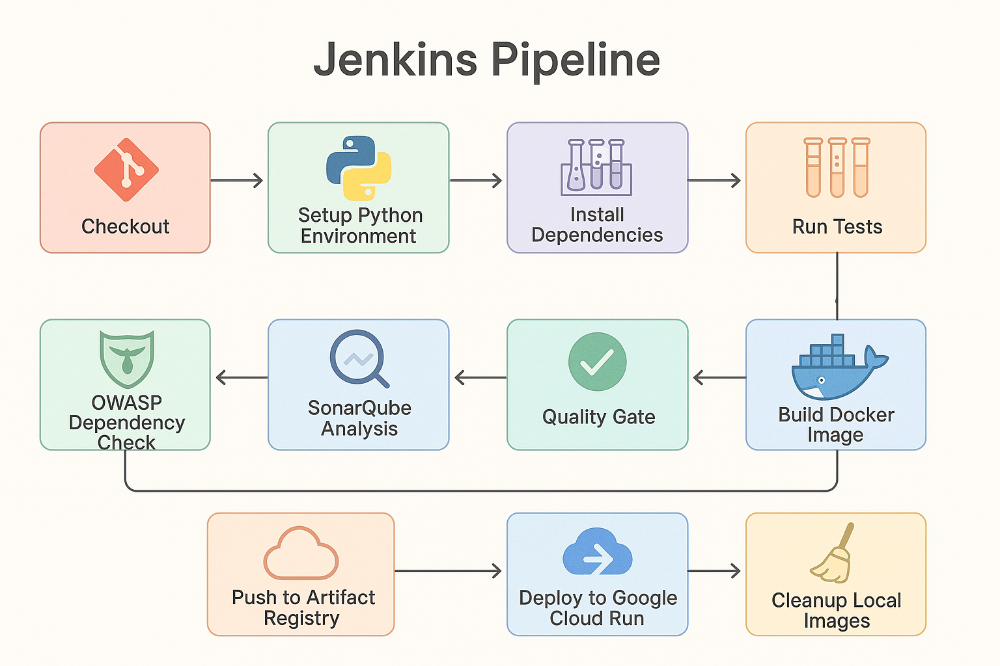

# htom [DevOps Lab]

A simple app to convert HTML to Markdown. Also contains functionality to do the reverse, alongside providing text statistics.

## Tools used

- FastAPI
- Docker
- Jenkins
- Jinja2 Templates
- Additional Azure Pipeline to publish the container to [DockerHub](https://hub.docker.com/r/themohitnair/htom)

## htom: Application

The Application is hosted [here](https://htom-1056258232007.us-central1.run.app/app)

## Pipeline

Here is a representation of the pipeline employed in htom:

